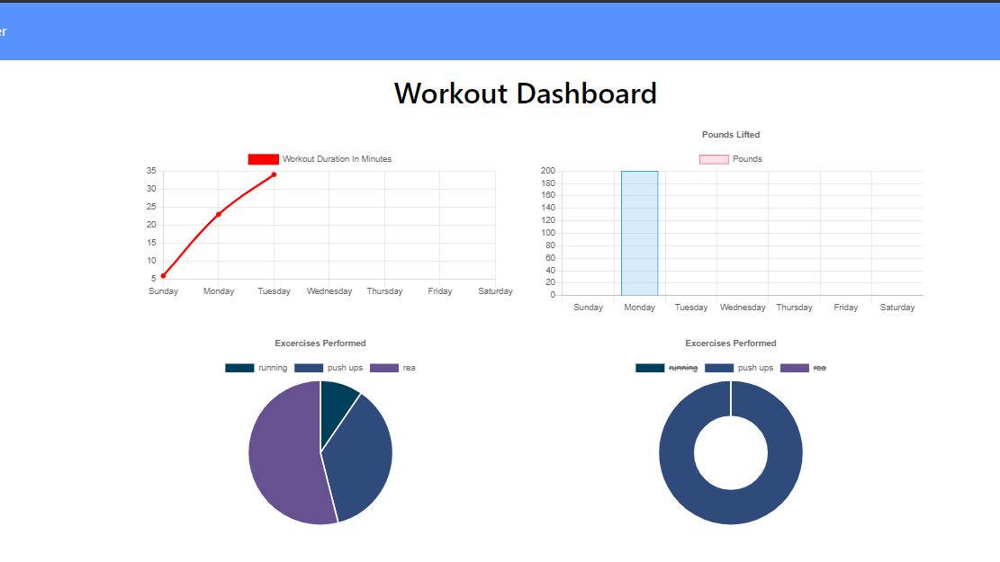

# Fitness Tracker
<h4 align="center">Node, Mongoose, Express</h4>

A consumer will reach their fitness goals quicker when they track their workout progress. In this app the user is able to view create and track daily workouts. they can log multiple exercises in a workout on a given day. Track the name, type, weight, sets, reps, and duration of exercise. If the exercise is a cardio exercise they can track their distance traveled. 

this app uses Mongo database with a Mongoose schema and handles routes with Express.

When the user loads the page, they are the option to create a new workout, or continue with their last workout.

The user is able to: Add exercises to a previous workout plan. Add new exercises to a new workout plan. View multiple the combined weight of multiple exercises on the stats page.

This app follows the MVC design pattern: Model, View, Controller.

# Demo

Heroku Deployment : [Fitness Tracker](https://limitless-journey-76220.herokuapp.com/)

# Technologies used

- [HTML](https://developer.mozilla.org/en-US/docs/Web/HTML)
- [CSS](https://developer.mozilla.org/en-US/docs/Web/CSS)
- [Bootstrap](https://getbootstrap.com/)
- [JavaScript](https://developer.mozilla.org/en-US/docs/Web/JavaScript)
- [Node.js](https://nodejs.org/en/) 
- [Express](https://www.npmjs.com/package/express)
- [Mongodb](https://www.mongodb.com/)

# Author

[Brett Sevy](https://github.com/BrettSevy) 

